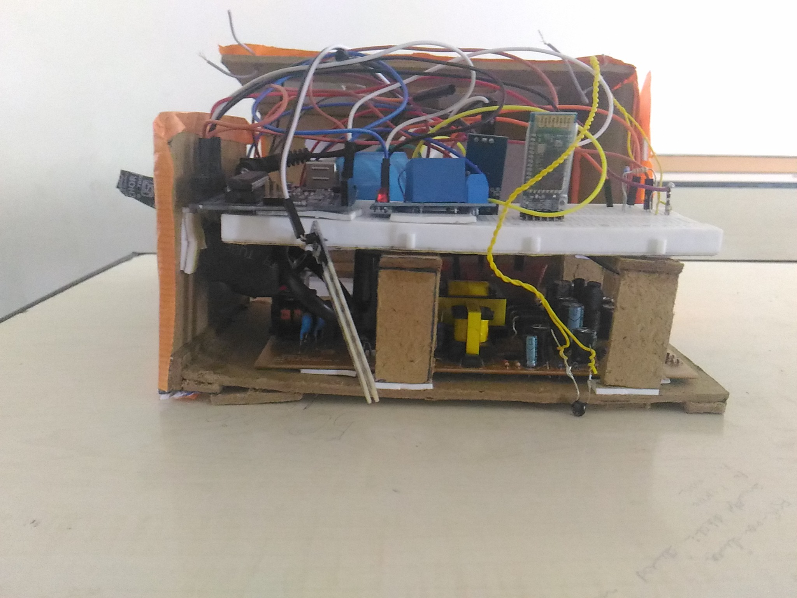

# Plantis

This is an Android application to trigger the smart irrigation System using bluetooth. On the hardware side we have HC05 classic bluetooth module, SPDT Relay and solenoid valve, Thermistor to check soil Temperature and temperature of surroundings. Soil Moisture sensor to check Soil moisture. The project is deployed on Arduino. For more on the Arduino part you can refer to 
[PlantisArduino](https://github.com/vbshightime/PlantisArduino) repo. We can periodicaly check all the constraints by just connecting to the HC05 bluetooth module. 

We have also employed Machine Learning on it. We have used Google Cloud vision API in order to serve our opperation. By just clicking the picture of plant we can predict what kind of plant is it.  

## Gallery
  
  

## Future Enhancement
* Create a dataset containing images of paddy pathology
* Train the dataset and Creat a Machine Learning model
* Feed the machine learning model to Android and predict the diseases in paddy.
* So just by clicking the picture of diseased paddy plant, we can predict the disease.
* One more model is to be trained containing Soil Moisture and Soil temperature regimes.
* With this model we can predict how much water that plant needs.
